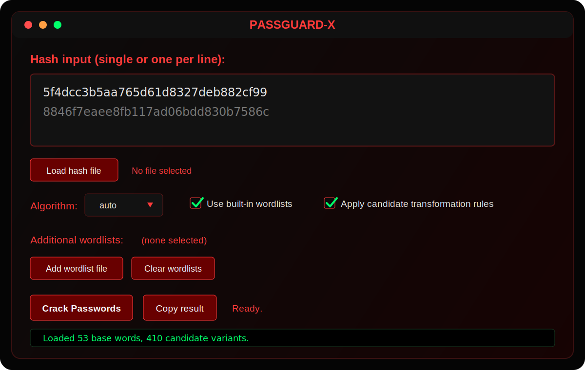

# PASSGUARD-X

> This tool is for educational, defensive, and authorized password auditing only. Do not use it against systems, accounts, or hashes you do not own or have explicit permission to test.

PASSGUARD-X is a red-themed password hash recovery tool with both a graphical app and a command-line interface.

## Screenshot



## Important

Use PASSGUARD-X only for local hash recovery, defensive auditing, training labs, or authorized security work. You are responsible for following all applicable laws and rules of engagement.

## Features

- Graphical app mode with a dark red PASSGUARD-X theme.
- Custom PASSGUARD-X desktop launcher icon.
- CLI mode from the same `passguard-x` command.
- Supports `md5`, `sha1`, `sha224`, `sha256`, `sha384`, `sha512`, `sha3_256`, and `ntlm`.
- Accepts one hash or a file containing many hashes.
- Loads built-in `.txt` wordlists from `wordlists/`.
- Supports extra wordlists, candidate rules, short brute-force candidates, threads, and output files.
- Falls back to a red-themed browser app if Tkinter is not installed.

## Requirements

- Python 3.10 or newer.
- No third-party Python packages are required.
- Optional GUI dependency: Tkinter. If Tkinter is unavailable, PASSGUARD-X automatically opens the red-themed browser app.

## Install

From inside the project folder:

```bash
cd /home/krzx-mythoz/projects/PASSGUARD-X
chmod +x install.sh
./install.sh
```

This creates the command:

```bash
passguard-x
```

If `~/.local/bin` is not in your terminal `PATH`, add this line to your shell config:

```bash
export PATH="$HOME/.local/bin:$PATH"
```

Do not replace your whole `PATH`; only add `~/.local/bin` to it. If your terminal says `env: 'bash': No such file or directory`, reset the basic path once:

```bash
export PATH="/usr/local/sbin:/usr/local/bin:/usr/bin:/bin:$HOME/.local/bin"
```

Then restart the terminal or run:

```bash
source ~/.bashrc
```

For Zsh users, put the `PATH` line in `~/.zshrc` and run:

```bash
source ~/.zshrc
```

## Install From GitHub

You can also install by passing a GitHub repo URL or `user/repo`:

```bash
./install.sh user/repo
```

or:

```bash
./install.sh https://github.com/user/repo.git
```

## Open The App

After installation, start the graphical app with:

```bash
passguard-x
```

You can also be explicit:

```bash
passguard-x app
```

or:

```bash
passguard-x gui
```

The desktop launcher also opens the app.

## Use The CLI

Crack one MD5 hash:

```bash
passguard-x --hash 5f4dcc3b5aa765d61d8327deb882cf99 --algorithm md5
```

Crack an NTLM hash:

```bash
passguard-x --hash 8846f7eaee8fb117ad06bdd830b7586c --algorithm ntlm
```

Crack hashes from a file:

```bash
passguard-x --hash-file hashes.txt --algorithm sha256
```

Use an extra wordlist:

```bash
passguard-x --hash-file hashes.txt --wordlist custom.txt --threads 4
```

Save results to a file:

```bash
passguard-x --hash-file hashes.txt --output passguard-results.txt
```

## Help Command

Show all options:

```bash
passguard-x --help
```

The same help works before installation:

```bash
python3 cracker.py --help
```

## Wordlists

- Built-in wordlists live in `wordlists/common.txt` and `wordlists/extra.txt`.
- Add your own `.txt` files to `wordlists/`, or pass them with `--wordlist`.
- Use `--no-builtin` if you only want custom wordlists.

## Project Structure

```text
PASSGUARD-X/
|-- assets/
|   `-- passguard-x.svg
|-- bin/
|   `-- run_passguard_x.sh
|-- docs/
|   `-- screenshots/
|       `-- gui-preview.svg
|-- tests/
|   `-- test_cracker.py
|-- wordlists/
|   |-- common.txt
|   `-- extra.txt
|-- cracker.py
|-- install.sh
|-- passguard-x.desktop
|-- requirements.txt
|-- LICENSE
`-- README.md
```

## Useful Options

- `--algorithm md5` forces one algorithm.
- `--no-rules` disables case, reverse, leetspeak, and suffix transformations.
- `--bruteforce-length 3` adds short brute-force candidates.
- `--threads 4` cracks multiple hashes concurrently.
- `--output results.txt` writes the CLI output to a file.

## Developer Check

Run tests:

```bash
python3 -m unittest discover -s tests
```

Run without installing:

```bash
python3 cracker.py
```

Run CLI without installing:

```bash
python3 cracker.py --hash 5f4dcc3b5aa765d61d8327deb882cf99 --algorithm md5
```
